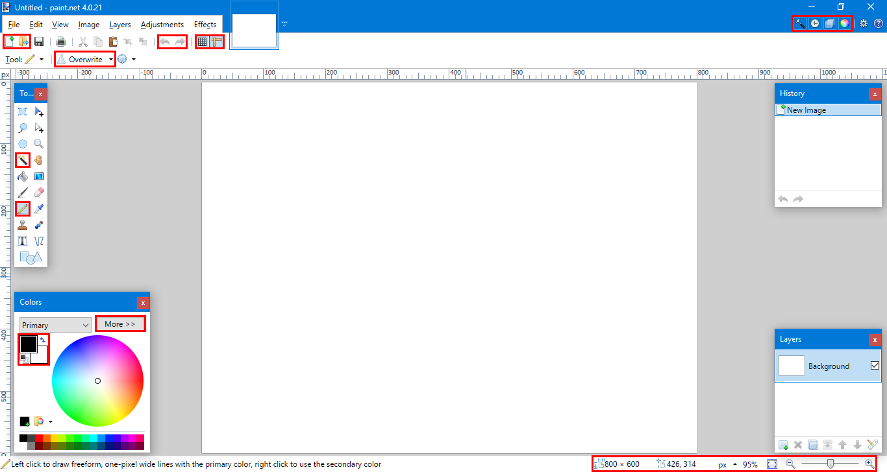
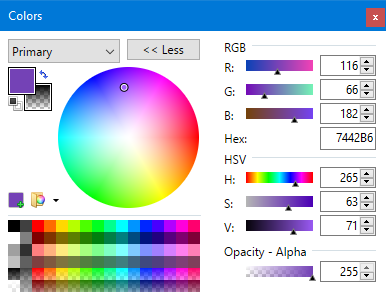
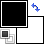
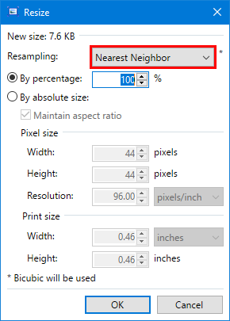

# Using Paint.NET for Pixel Art

## Interface
*  **Show/Hide Windows:** Each of these buttons controls the visibility of **Tools**, **History**, **Layers**, and **Colors**.
*  **New/Open:** Click New to set the size of your sprite before you begin. Most sprites are **8×8**, **16×16**, or **32×32**.
*  **Undo/Redo:** These can also be accessed with **CTRL+Z** and **CTRL+Y**
*  **Grid/Ruler:** The grid button draws lines over your image to line up pixels, while the ruler shows the coordinates of your cursor on the top and left sides of the canvas.
*  **Blending Mode:** Make sure that the Pencil Tool is selected before changing this value, but for our purposes it should always be set to **Overwrite**.
*  **Magic Wand Tool:** Click an area with this tool selected to select an area of similarly colored pixels. Use the  **Tolerance Slider** to adjust sensitivity. Press **Delete** to make the selected area transparent.
*  **Pencil Tool:** Use this tool to draw individual pixels on to your image. Click and drag to draw with your **Primary Color**. Right click and drag to draw with your **Secondary Color**.
*  **Image Info:** This area shows the size of the image, the cursor's coordinates, and current zoom level. Use the slider to zoom.

*  **Open Pallete:** Click this to edit the selected color. Set **Opacity - Alpha** to zero in order to use your pencil tool like an eraser.
*  **Primary/Secondary Colors:** Click the top-left square to edit the color drawn with left click. Click the bottom-right square to edit the color drawn with right click. Click the tiny black and white squares to set left click to black and right click to white.

## Navigation
* The **Scroll Wheel** moves the canvas up and down.
* Hold **Shift** while scrolling to move left and right.
* Hold **Control** while scrolling to zoom in and out.
* Click and drag with the **Scroll Wheel** to move the canvas.

## Before Saving
1. Use the  **Magic Wand** to select any areas in the background that you want to be transparent. Adjust the  **Tolerance** at the top of the screen if you need to. Press **Delete** to remove the selected area.
2. If your sprite is not square or has empty space around it, you may need to crop it. Select the  **Magic Wand** and adjust the  **Tolerance** to select what you want to save. In the toolbar at the top, select **Image -> Crop to Selection**.
3. So that your sprite is not tiny when used in your program, you need to resize it. In the toolbar at the top, select **Image -> Resize...** and a new window should appear. Make sure that **Resampling** is set to **Nearest Neighbor** or your image will look blurry when it is resized. You may want to save a copy of your original sprite if you want to make edits later.

4. Make sure to save images as **PNG (\*.png)**, since jpegs do not save transparency. Make sure to use the whole name of the file in your code (ex: \"goblin.png\") and that it is saved into the same folder that your code is saved in.
